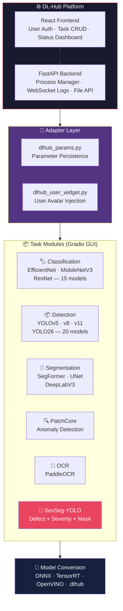
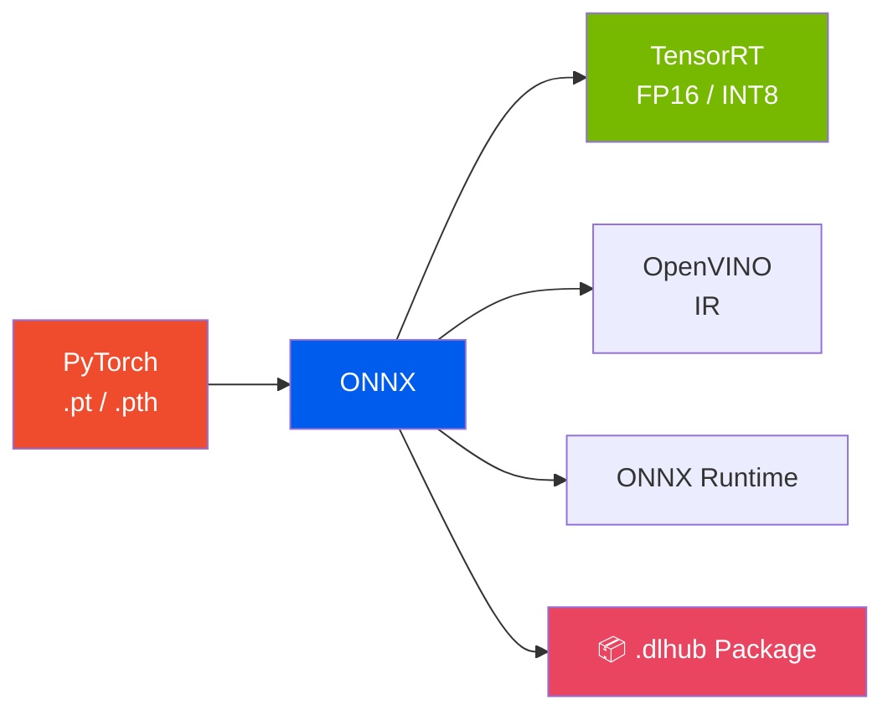

<div align="center">

<br>

<picture>
  <source media="(prefers-color-scheme: dark)" srcset="https://img.shields.io/badge/🧠_DL--Hub-Deep_Learning_Workstation-blue?style=for-the-badge&labelColor=0d1117">
  
</picture>

<br><br>

### Unified Deep Learning Workstation

### 6 Tasks · One Platform · Full GUI · No Coding Required

<br>

<a href="README_zh.md"></a>

<br><br>


<br><br>

> DL-Hub is a complete deep learning workstation that unifies **6 computer vision tasks** into a single web platform. From data preparation to model deployment — everything through a GUI, zero coding needed.

<br>

</div>

---

<br>

## 🖼️ Screenshots

<div align="center">

| Login | Dashboard | Task Interface |
|:---:|:---:|:---:|
|  |  |  |
| Multi-user authentication | Task management & monitoring | Gradio-powered training GUI |

</div>

<br>

---

<br>

## ✨ Platform Features

<br>

### 🌐 DL-Hub Management Platform

<table>
<tr><td width="50%">

**🔐 Multi-User System**
- User registration and login authentication
- Session management with secure tokens
- Each user has isolated task workspace

**📋 Task Lifecycle Management**
- Create / Import / Copy / Edit / Delete tasks
- Drag-and-drop task organization
- Real-time task status monitoring (idle → training → completed)
- Automatic parameter persistence across sessions

</td><td width="50%">

**🚀 One-Click Launch**
- Click task card → Gradio GUI opens in new tab
- Automatic conda environment activation
- Automatic port conflict detection and resolution
- WebSocket real-time log streaming

**📊 System Monitoring**
- GPU utilization and memory tracking
- Disk space monitoring per task
- Training progress bars and metric curves
- Process management (start / stop / restart)

</td></tr>
</table>

<br>

### 🎯 Unified Task Modules

Every task module follows the same 4-tab pattern: **Data → Train → Export → Inference**

<table>
<tr><td width="50%">

**📂 Data Management**
- LabelMe JSON → YOLO format auto-converter
- VOC / Cityscapes format converter
- Train/val split with configurable ratio
- Data validation with error reports
- Per-class distribution visualization

</td><td width="50%">

**🏋️ Training**
- Model selection dropdown (from model registry)
- Hyperparameter GUI (learning rate, batch size, epochs...)
- Real-time loss / mAP / accuracy curves
- GPU device selection (multi-GPU support)
- Checkpoint resume (continue interrupted training)
- Training state auto-save

</td></tr>
<tr><td>

**🔄 Model Export**
- PyTorch → ONNX (configurable opset)
- ONNX → TensorRT FP16/INT8
- ONNX → OpenVINO IR
- `.dlhub` one-click deploy package
- Export validation with precision check

</td><td>

**🔍 Batch Inference**
- Single image or folder batch processing
- Confidence threshold slider
- Result visualization (detection boxes, masks, heatmaps)
- Sample preview with navigation
- Auto-save all outputs to disk

</td></tr>
</table>

<br>

### 💾 Smart Parameter System

```
DLHubParams — Unified parameter persistence across sessions
├── Auto-save all UI settings (model, hyperparams, paths)
├── Training history tracking (loss, accuracy per epoch)
├── Atomic writes (temp file → rename, no corruption)
├── File-path-based singleton (one instance per task)
└── Max 500 epoch history, 200 log lines (auto-trim)
```

When you close the browser and reopen later, **every slider, dropdown, and text field restores to where you left off**.

<br>

---

<br>

## 🏗️ Architecture



<br>

---

<br>

## 📦 Supported Tasks (Detailed)

<br>

### 🏷️ Image Classification

<table><tr><td>

| Feature | Detail |
|:---|:---|
| **Models** | EfficientNet-B0/B2/B4, MobileNetV3-Small/Large, ResNet-18/34/50 |
| **Total** | 15 pretrained models via [timm](https://github.com/huggingface/pytorch-image-models) |
| **Data format** | Folder-per-class: `dataset/cat/img001.jpg` |
| **GUI tabs** | Training · Model Export · Batch Inference |
| **Features** | Auto class mapping, learning rate scheduler, data augmentation, confusion matrix, per-class accuracy |

</td></tr></table>

<br>

### 📦 Object Detection

<table><tr><td>

| Feature | Detail |
|:---|:---|
| **Models** | YOLOv5-n/s/m/l/x, YOLOv8-n/s/m/l/x, YOLOv11-n/s/m/l/x, YOLO26-n/s/m/l/x |
| **Total** | 20 pretrained models via [Ultralytics](https://github.com/ultralytics/ultralytics) |
| **Data format** | YOLO format (auto-converted from LabelMe) |
| **GUI tabs** | Training · Model Export · Batch Inference |
| **Features** | LabelMe→YOLO converter, checkpoint resume, mAP tracking, multi-GPU, TensorRT export |

</td></tr></table>

<br>

### 🎨 Semantic Segmentation

<table><tr><td>

| Feature | Detail |
|:---|:---|
| **Models** | SegFormer-B0/B1/B2/B3/B4/B5, UNet, DeepLabV3 |
| **Data format** | VOC or Cityscapes format (auto-converted) |
| **GUI tabs** | Training · Model Export · Batch Inference |
| **Features** | VOC/Cityscapes converter, batch inference with overlay visualization, SegFormer ONNX export, mIoU evaluation |

</td></tr></table>

<br>

### 🔍 Anomaly Detection (PatchCore)

<table><tr><td>

| Feature | Detail |
|:---|:---|
| **Algorithm** | PatchCore — feature memory bank for one-class anomaly detection |
| **Data requirement** | **Normal samples only** — no defect samples needed for training |
| **GUI tabs** | Data Config · Training Status · Evaluation · Batch Detection · Settings · Help |
| **Features** | Automatic threshold calibration, anomaly score heatmaps, ONNX export, CLI + GUI dual entry |

</td></tr></table>

<br>

### 📝 OCR (Optical Character Recognition)

<table><tr><td>

| Feature | Detail |
|:---|:---|
| **Engine** | [PaddleOCR](https://github.com/PaddlePaddle/PaddleOCR) (text detection + recognition) |
| **GUI tabs** | Quick Recognition · Batch Processing · Model Export · Settings |
| **Features** | Multi-language support, batch folder OCR, ONNX/TensorRT export, result preview |

</td></tr></table>

<br>

### 🔬 Industrial Defect Detection (SevSeg-YOLO)

<table><tr><td>

| Feature | Detail |
|:---|:---|
| **Models** | YOLO26-Score: n (2.57M) / s (10.19M) / m (22.19M) / l (26.59M) / x (56.08M) |
| **Three-in-one** | Detection + Severity Scoring (0–10) + Zero-Annotation Mask Generation |
| **Loss function** | Gaussian NLL — models ±1 annotation noise, MAE ↓21% vs Smooth L1 |
| **MaskGenerator** | Bimodal Top-K channel selection + Canny edge-guided upsampling, CPU 1.13ms, 100% validity |
| **GUI tabs** | Data Conversion · Training · Model Export · Batch Inference |
| **Features** | LabelMe severity annotation, severity distribution charts, real-time loss/mAP/score curves, 4-panel inference preview (detection + P3 heatmap + binary mask + contour overlay) |
| **Standalone** | Also available as independent project: [SevSeg-YOLO](https://github.com/sevseg-yolo/sevseg-yolo) |

</td></tr></table>

<br>

---

<br>

## 🔄 Model Conversion Pipeline

DL-Hub includes a universal model conversion system supporting **multiple frameworks and formats**:



**`.dlhub` Package** — one-click deployable bundle containing:
- Exported model file (ONNX/TensorRT/OpenVINO)
- Preprocessing config (input size, normalization, letterbox settings)
- Class names and metadata
- Auto-generated deployment README
- SHA256 integrity verification

<br>

---

<br>

## 📖 User Manuals

Every task module includes a **built-in HTML user manual** (accessible via the "📖 User Guide" button in the task page):

| Task | Manual | Size |
|:---|:---|:---:|
| Classification | `classification-manual.html` | 2,539 lines |
| Detection | `detection-manual.html` | 2,152 lines |
| Segmentation | `segmentation-manual.html` | 2,391 lines |
| Anomaly Detection | `anomaly-detection-manual.html` | 2,270 lines |
| OCR | `ocr-manual.html` | 1,557 lines |
| SevSeg-YOLO | `sevseg-manual.html` | 1,445 lines |

Each manual covers: architecture explanation, complete workflow tutorial, parameter reference, FAQ, and troubleshooting.

<br>

---

<br>

## 🚀 Getting Started

### 1. Clone & Install

```bash
git clone https://github.com/your-org/DL-Hub.git
cd DL-Hub
pip install -r requirements.txt
```

### 2. Launch the Platform

```bash
python run_dlhub.py
```

Opens `http://127.0.0.1:7860` in your browser. Register an account on first launch.

### 3. Create Your First Task

1. **Select task type** from the home page (e.g., "Object Detection")
2. **Click "New Task"** → enter name, select working directory, choose conda environment
3. **Click the task card** → Gradio training GUI opens in a new tab
4. **Prepare data** → click the data tab, point to your image/annotation folder
5. **Configure & train** → select model, set hyperparameters, click "Start Training"
6. **Export** → convert trained model to ONNX or TensorRT
7. **Inference** → batch test on new images with visualization

<br>

---

<br>

## 📁 Project Structure

```
DL-Hub/
├── 📄 README.md / README_zh.md        # Documentation (EN/CN)
├── 📄 LICENSE                          # Apache-2.0 (AGPL for sevseg)
├── 📄 requirements.txt                # Platform dependencies
├── 📄 CHANGELOG.md / CONTRIBUTING.md  # Release notes & contribution guide
├── 🚀 run_dlhub.py                    # Root entry point
│
├── 🔌 dlhub_params.py                 # Parameter persistence (singleton per task)
├── 🔌 dlhub_user_widget.py            # User avatar injection for Gradio
│
├── 🌐 dlhub_project/                  # Platform
│   ├── dlhub/
│   │   ├── frontend/dist/             #   Pre-built React SPA
│   │   ├── backend/
│   │   │   ├── main.py                #   FastAPI app (auth middleware, WebSocket, routes)
│   │   │   ├── routers/               #   tasks.py, auth.py, app_launcher.py, system.py
│   │   │   └── services/              #   TaskService, ProcessService, AuthService
│   │   └── users.json                 #   User store (auto-created on first launch)
│   ├── user_manual/                   #   6 × HTML user manuals
│   ├── docs/                          #   Developer docs (integration guide, task structure)
│   └── run_dlhub.py                   #   Platform launcher (auto port, browser open)
│
├── 📦 model_image_classification/     #   15 models: EfficientNet/MobileNetV3/ResNet × 5
│   ├── app.py                         #     Gradio GUI (2,195 lines)
│   ├── config/model_registry.py       #     Model configs & pretrained weights
│   ├── engine/trainer.py              #     Training engine with callbacks
│   └── models/model_factory.py        #     timm model loader
│
├── 📦 model_image_detection/          #   20 models: YOLOv5/v8/v11/YOLO26 × 5
│   ├── app.py                         #     Gradio GUI (2,712 lines)
│   ├── data/converter.py              #     LabelMe → YOLO converter
│   └── engine/checkpoint.py           #     Checkpoint resume
│
├── 📦 model_image_segmentation/       #   SegFormer/UNet/DeepLabV3
│   ├── app.py                         #     Gradio GUI (2,996 lines)
│   ├── data/                          #     VOC & Cityscapes converters
│   └── inference/batch_inference.py   #     Batch inference (1,236 lines)
│
├── 📦 model_image_patchcore/          #   PatchCore anomaly detection
│   ├── gui/app.py                     #     6-tab Gradio GUI
│   ├── engine/trainer.py              #     Feature memory bank training
│   └── inference/predictor.py         #     Anomaly scoring
│
├── 📦 model_image_ocr/               #   PaddleOCR engine
│   ├── gui/app.py                     #     4-tab Gradio GUI
│   ├── engines/ocr_engine.py          #     PaddleOCR wrapper
│   └── export/                        #     ONNX export
│
├── 📦 model_image_sevseg/            #   SevSeg-YOLO (with bundled ultralytics)
│   ├── app.py                         #     4-tab Gradio GUI
│   ├── sevseg_yolo/                   #     Core: model, mask_generator_v3, evaluation
│   ├── ultralytics/                   #     Modified Ultralytics (ScoreHead, GaussianNLL)
│   └── engine/trainer.py              #     SevSeg training with callbacks
│
├── 🔄 model_conversion/              #   Universal export pipeline
│   ├── model_importer.py             #     Multi-format checkpoint parser (3,050 lines)
│   ├── model_exporter.py             #     ONNX export engine (2,109 lines)
│   ├── converter_tensorrt.py         #     TensorRT FP16/INT8 builder
│   ├── converter_openvino.py         #     OpenVINO converter
│   └── dlhub_packager.py            #     .dlhub deploy package builder
│
├── 📋 docs/images/                    #   Screenshots for README
└── 🧪 tests/                         #   Test scripts
```

<br>

---

<br>

## ⚠️ Notes

> **Conda environments** — Each task can use a different conda environment. Configure when creating the task.

> **GPU** — CUDA GPU recommended for training. All modules support CPU inference.

> **Frontend rebuild** — Pre-built React app in `dlhub_project/dlhub/frontend/dist/`. To rebuild: `cd frontend && npm install && npm run build`.

> **License** — Main project is Apache-2.0. The `model_image_sevseg/ultralytics/` directory is AGPL-3.0 (from Ultralytics). See [LICENSE](LICENSE) for details.

> **First launch** — The platform creates `users.json` and `.dlhub/` on first run. No pre-configuration needed.

<br>

---

<div align="center">

## 📖 Citation

</div>

```bibtex
@software{dlhub_2026,
  title   = {DL-Hub: Unified Deep Learning Workstation},
  author  = {DL-Hub Contributors},
  year    = {2026},
  url     = {https://github.com/your-org/DL-Hub}
}
```

<div align="center">

**[Apache-2.0 License](LICENSE)** · Built with [FastAPI](https://fastapi.tiangolo.com/) · [Gradio](https://gradio.app/) · [React](https://react.dev/) · [Ultralytics](https://github.com/ultralytics/ultralytics) · [PaddleOCR](https://github.com/PaddlePaddle/PaddleOCR) · [timm](https://github.com/huggingface/pytorch-image-models)

</div>
