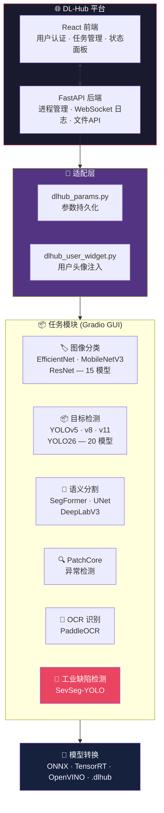
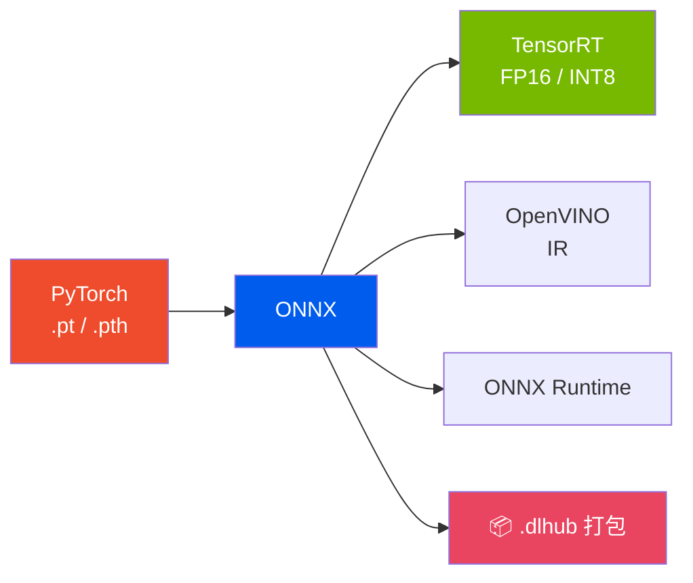

<div align="center">

<br>

<picture>
  <source media="(prefers-color-scheme: dark)" srcset="https://img.shields.io/badge/🧠_DL--Hub-深度学习工作站-blue?style=for-the-badge&labelColor=0d1117">
  
</picture>

<br><br>

### 统一深度学习工作站

### 6 大任务 · 统一平台 · 全GUI操作 · 零代码门槛

<br>

<a href="README.md"></a>

<br><br>


<br><br>

> DL-Hub 是一个完整的深度学习工作站，将 **6 种计算机视觉任务** 统一到一个 Web 平台。从数据准备到模型部署——全程 GUI 操作，无需编写任何代码。

<br>

</div>

---

<br>

## 🖼️ 界面预览

<div align="center">

| 登录界面 | 主控制台 | 任务训练界面 |
|:---:|:---:|:---:|
|  |  |  |
| 安全多用户认证 | 任务管理与状态监控 | Gradio 训练全流程 GUI |

</div>

<br>

---

<br>

## ✨ 平台特性

<br>

### 🌐 DL-Hub 管理平台

<table>
<tr><td width="50%">

**🔐 多用户系统**
- 用户注册与登录认证
- 安全令牌会话管理
- 用户间任务工作区隔离

**📋 任务全生命周期管理**
- 创建 / 导入 / 复制 / 编辑 / 删除任务
- 拖拽排序任务卡片
- 实时任务状态监控（空闲 → 训练中 → 已完成）
- UI 参数自动保存，跨会话恢复

</td><td width="50%">

**🚀 一键启动**
- 点击任务卡片 → Gradio GUI 在新标签页打开
- 自动激活对应 Conda 环境
- 自动端口冲突检测与切换
- WebSocket 实时日志推送

**📊 系统监控**
- GPU 利用率和显存追踪
- 每个任务的磁盘占用统计
- 训练进度条和指标曲线
- 进程管理（启动 / 停止 / 重启）

</td></tr>
</table>

<br>

### 🎯 统一任务模块

每个任务模块遵循相同的 4 标签页模式：**数据 → 训练 → 导出 → 推理**

<table>
<tr><td width="50%">

**📂 数据管理**
- LabelMe JSON → YOLO 格式自动转换
- VOC / Cityscapes 格式转换器
- 训练/验证集按比例自动划分
- 数据验证与错误报告
- 类别分布可视化图表

</td><td width="50%">

**🏋️ 模型训练**
- 下拉框选择模型（来自模型注册表）
- 超参数全 GUI 配置（学习率、batch、epoch…）
- 实时 loss / mAP / accuracy 曲线
- GPU 设备选择（支持多卡）
- 断点续训（继续中断的训练）
- 训练状态自动保存

</td></tr>
<tr><td>

**🔄 模型导出**
- PyTorch → ONNX（可配置 opset）
- ONNX → TensorRT FP16/INT8
- ONNX → OpenVINO IR
- `.dlhub` 一键部署打包
- 导出验证与精度校验

</td><td>

**🔍 批量推理**
- 单张图片或文件夹批量处理
- 置信度阈值滑块调节
- 结果可视化（检测框、掩膜、热力图）
- 样本预览与前后翻页
- 自动保存所有输出结果

</td></tr>
</table>

<br>

### 💾 智能参数系统

```
DLHubParams — 跨会话统一参数持久化
├── 自动保存所有UI设置（模型、超参数、路径）
├── 训练历史追踪（每轮 loss、accuracy）
├── 原子写入（临时文件→重命名，不会损坏）
├── 基于文件路径的单例模式（每个任务一个实例）
└── 最多 500 轮历史，200 条日志（自动裁剪）
```

关闭浏览器后重新打开，**每一个滑块、下拉框、文本框都恢复到你上次的状态**。

<br>

---

<br>

## 🏗️ 架构



<br>

---

<br>

## 📦 六大任务详解

<br>

### 🏷️ 图像分类

<table><tr><td>

| 特性 | 详情 |
|:---|:---|
| **模型** | EfficientNet-B0/B2/B4、MobileNetV3-Small/Large、ResNet-18/34/50 |
| **总计** | 15 个预训练模型，通过 [timm](https://github.com/huggingface/pytorch-image-models) 加载 |
| **数据格式** | 按类别文件夹组织：`dataset/猫/img001.jpg` |
| **GUI标签页** | 模型训练 · 模型转换 · 批量推理 |
| **特色** | 自动类别映射、学习率调度器、数据增强配置、混淆矩阵、分类别准确率 |

</td></tr></table>

<br>

### 📦 目标检测

<table><tr><td>

| 特性 | 详情 |
|:---|:---|
| **模型** | YOLOv5-n/s/m/l/x、YOLOv8-n/s/m/l/x、YOLOv11-n/s/m/l/x、YOLO26-n/s/m/l/x |
| **总计** | 20 个预训练模型，通过 [Ultralytics](https://github.com/ultralytics/ultralytics) 加载 |
| **数据格式** | YOLO 格式（支持 LabelMe 自动转换） |
| **GUI标签页** | 模型训练 · 模型转换 · 批量推理 |
| **特色** | LabelMe→YOLO 自动转换、断点续训、mAP 实时追踪、多 GPU 支持、TensorRT 导出 |

</td></tr></table>

<br>

### 🎨 语义分割

<table><tr><td>

| 特性 | 详情 |
|:---|:---|
| **模型** | SegFormer-B0/B1/B2/B3/B4/B5、UNet、DeepLabV3 |
| **数据格式** | VOC 或 Cityscapes 格式（支持自动转换） |
| **GUI标签页** | 模型训练 · 模型转换 · 批量推理 |
| **特色** | VOC/Cityscapes 格式转换器、批量推理叠加可视化、SegFormer ONNX 导出、mIoU 评估 |

</td></tr></table>

<br>

### 🔍 异常检测 (PatchCore)

<table><tr><td>

| 特性 | 详情 |
|:---|:---|
| **算法** | PatchCore — 基于特征记忆库的单分类异常检测 |
| **数据要求** | **只需正常样本** — 训练不需要缺陷样本 |
| **GUI标签页** | 数据配置 · 训练状态 · 评估验证 · 批量检测 · 系统设置 · 帮助文档 |
| **特色** | 自动阈值校准、异常分数热力图、ONNX 导出、CLI + GUI 双入口 |

</td></tr></table>

<br>

### 📝 OCR 识别

<table><tr><td>

| 特性 | 详情 |
|:---|:---|
| **引擎** | [PaddleOCR](https://github.com/PaddlePaddle/PaddleOCR)（文字检测 + 识别） |
| **GUI标签页** | 快速识别 · 批量处理 · 模型导出 · 设置 |
| **特色** | 多语言支持、文件夹批量 OCR、ONNX/TensorRT 导出、结果预览 |

</td></tr></table>

<br>

### 🔬 工业缺陷检测 (SevSeg-YOLO)

<table><tr><td>

| 特性 | 详情 |
|:---|:---|
| **模型** | YOLO26-Score：n(2.57M) / s(10.19M) / m(22.19M) / l(26.59M) / x(56.08M) |
| **三合一能力** | 检测 + 严重程度评分 (0–10) + 零标注掩膜生成 |
| **损失函数** | 高斯 NLL — 显式建模 ±1 分标注噪声，MAE 比 Smooth L1 降低 21% |
| **MaskGenerator** | 双峰 Top-K 通道选择 + Canny 引导上采样，CPU 1.13ms，100% 有效率 |
| **GUI标签页** | 数据转换 · 模型训练 · 模型转换 · 批量推理 |
| **特色** | LabelMe severity 标注、严重程度分布图、实时 loss/mAP/score 三曲线、4面板推理预览（检测图 + P3热力图 + 二值mask + 轮廓叠加） |
| **独立项目** | 也作为独立项目开源：[SevSeg-YOLO](https://github.com/sevseg-yolo/sevseg-yolo) |

</td></tr></table>

<br>

---

<br>

## 🔄 模型转换流水线

DL-Hub 内置通用模型转换系统，支持**多框架多格式**：



**`.dlhub` 部署包** — 一键可部署的完整包，包含：
- 导出的模型文件（ONNX/TensorRT/OpenVINO）
- 预处理配置（输入尺寸、归一化、letterbox 参数）
- 类别名和元数据
- 自动生成的部署 README
- SHA256 完整性校验

<br>

---

<br>

## 📖 内置使用手册

每个任务模块都配备了**完整的 HTML 使用手册**（在任务页面点击"📖 使用指南"按钮即可打开）：

| 任务 | 手册文件 | 规模 |
|:---|:---|:---:|
| 图像分类 | `classification-manual.html` | 2,539 行 |
| 目标检测 | `detection-manual.html` | 2,152 行 |
| 语义分割 | `segmentation-manual.html` | 2,391 行 |
| 异常检测 | `anomaly-detection-manual.html` | 2,270 行 |
| OCR 识别 | `ocr-manual.html` | 1,557 行 |
| 工业缺陷检测 | `sevseg-manual.html` | 1,445 行 |

每份手册包含：架构原理说明、完整操作教程、参数参考、常见问题、故障排除。

<br>

---

<br>

## 🚀 快速开始

### 1. 克隆安装

```bash
git clone https://github.com/your-org/DL-Hub.git
cd DL-Hub
pip install -r requirements.txt
```

### 2. 启动平台

```bash
python run_dlhub.py
```

浏览器自动打开 `http://127.0.0.1:7860`。首次启动需注册账号。

### 3. 创建你的第一个任务

1. **选择任务类型**（如"目标检测"）
2. **点击"新建任务"** → 输入名称、选择工作目录、选择 Conda 环境
3. **点击任务卡片** → Gradio 训练 GUI 在新标签页打开
4. **准备数据** → 在数据标签页指定图片/标注文件夹
5. **配置并训练** → 选择模型、设置超参数、点击"开始训练"
6. **导出模型** → 将训练好的模型转换为 ONNX 或 TensorRT
7. **批量推理** → 在新图片上测试，可视化查看结果

<br>

---

<br>

## 📁 项目结构

```
DL-Hub/
├── 📄 README.md / README_zh.md        # 项目文档（中英文）
├── 📄 LICENSE                          # Apache-2.0（sevseg 为 AGPL）
├── 📄 requirements.txt                # 平台依赖
├── 📄 CHANGELOG.md / CONTRIBUTING.md  # 版本记录与贡献指南
├── 🚀 run_dlhub.py                    # 根目录启动入口
│
├── 🔌 dlhub_params.py                 # 参数持久化（每任务单例）
├── 🔌 dlhub_user_widget.py            # Gradio 用户头像注入
│
├── 🌐 dlhub_project/                  # 平台层
│   ├── dlhub/
│   │   ├── frontend/dist/             #   预构建 React 单页应用
│   │   ├── backend/                   #   FastAPI (认证/任务/启动/系统)
│   │   └── users.json                 #   用户数据（首次启动自动创建）
│   ├── user_manual/                   #   6 份 HTML 使用手册
│   └── run_dlhub.py                   #   平台启动器（自动端口/浏览器）
│
├── 📦 model_image_classification/     #   15 模型: EfficientNet/MobileNetV3/ResNet
├── 📦 model_image_detection/          #   20 模型: YOLOv5/v8/v11/YOLO26
├── 📦 model_image_segmentation/       #   SegFormer/UNet/DeepLabV3
├── 📦 model_image_patchcore/          #   PatchCore 异常检测
├── 📦 model_image_ocr/               #   PaddleOCR 文字识别
├── 📦 model_image_sevseg/            #   SevSeg-YOLO 工业缺陷检测
│
├── 🔄 model_conversion/              #   通用模型转换流水线
├── 📋 docs/images/                    #   README 截图
└── 🧪 tests/                         #   测试脚本
```

<br>

---

<br>

## ⚠️ 注意事项

> **Conda 环境** — 每个任务可以使用不同的 Conda 环境，创建任务时选择。

> **GPU 支持** — 训练推荐 CUDA GPU，所有模块均支持 CPU 推理。

> **前端重构** — 预编译 React 在 `dlhub_project/dlhub/frontend/dist/`。如需重构：`cd frontend && npm install && npm run build`。

> **许可证** — 主项目 Apache-2.0。`model_image_sevseg/ultralytics/` 目录为 AGPL-3.0（来自 Ultralytics）。详见 [LICENSE](LICENSE)。

> **首次启动** — 平台会自动创建 `users.json` 和 `.dlhub/` 目录，无需预配置。

<br>

---

<div align="center">

## 📖 引用

</div>

```bibtex
@software{dlhub_2026,
  title   = {DL-Hub: 统一深度学习工作站},
  author  = {DL-Hub Contributors},
  year    = {2026},
  url     = {https://github.com/your-org/DL-Hub}
}
```

<div align="center">

**[Apache-2.0 许可证](LICENSE)** · 基于 [FastAPI](https://fastapi.tiangolo.com/) · [Gradio](https://gradio.app/) · [React](https://react.dev/) · [Ultralytics](https://github.com/ultralytics/ultralytics) · [PaddleOCR](https://github.com/PaddlePaddle/PaddleOCR) · [timm](https://github.com/huggingface/pytorch-image-models)

</div>
